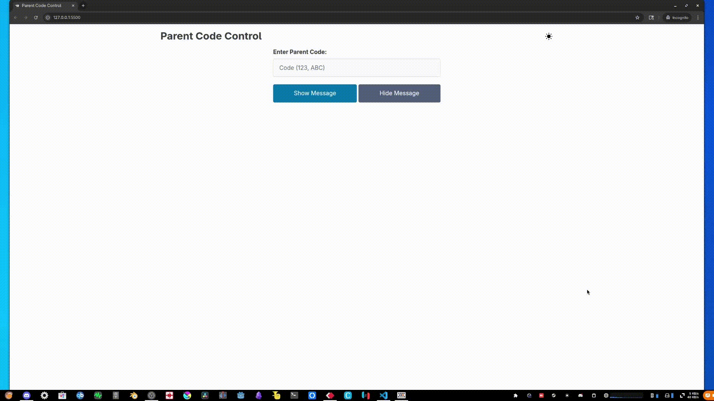

# GreenTree Parent Code

## Demo
### Parent Website Screen


### Screen Output


## Overview
GreenTree Parent Code is a web-based application designed for volunteers at the child care front desk of church to parent pickup codes to the church to pickup their children. 
The project utilizes Pico CSS for styling and includes custom styles defined in `styles.css`. It also incorporates JavaScript functionality for dynamic features such as theme switching, modal interactions, and toast notifications.

## Features
- **Responsive Design**: The application is styled using Pico CSS and custom CSS to ensure responsiveness across various screen sizes.
- **ProPresenter API Integration**: Interacts with the ProPresenter API for live updates and changes to congregation screens.
- **Theme Switching**: Users can toggle between light and dark themes using the theme switcher.
- **Toast Notifications**: Provides visual feedback for user actions with customizable toast messages.
- **Dynamic Modals**: Interactive modals for user confirmations and alerts.


## Local
1. Clone the repository:
   ```bash
   git clone <repository-url>
   ```
2. Navigate to the project directory:
   ```bash
   cd greentree-parent-code
   ```
3. Edit `config.js` to the IP address of computer on network running ProPresenter

4. Open `index.html` in your browser to view the webpage.

## Website
- Open the web page in a browser.
- Use the theme toggle button to switch between light and dark modes.

## Dependencies
- **Pico CSS**: A lightweight CSS framework for styling.

## Contributing
Contributions are welcome! Please fork the repository and submit a pull request with your changes.

## License
This project is licensed under the MIT License.